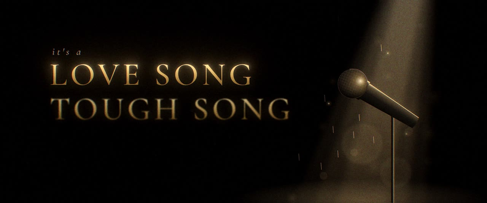
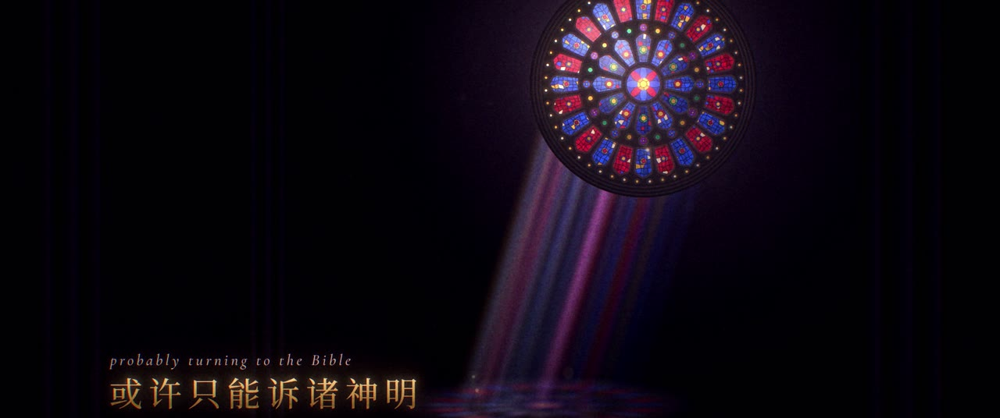
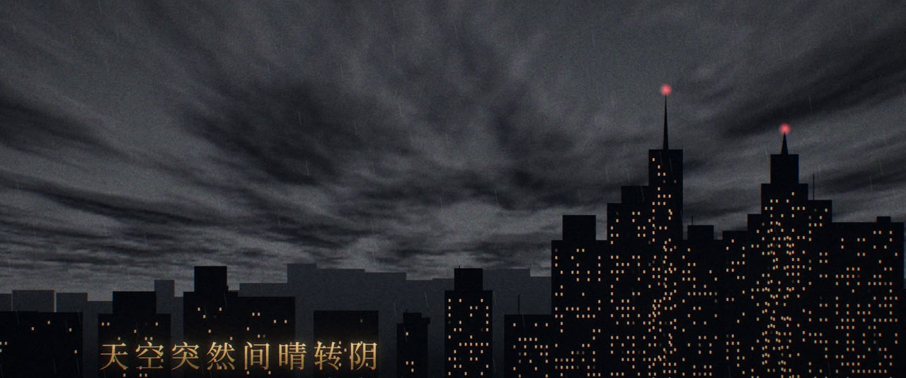
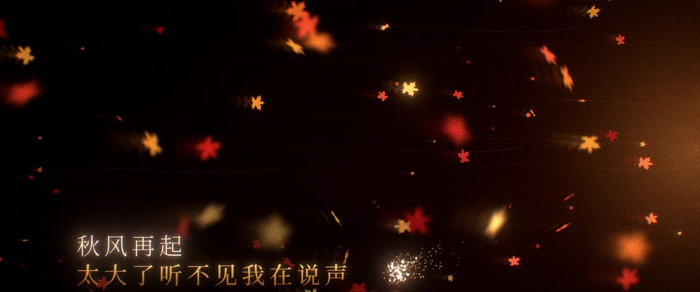

# Rapeter《林宛瑜》MV · 前 1:32

**成片：[`output/林宛瑜-MV.mp4`](output/林宛瑜-MV.mp4)**：1920×1080，24fps，2.39:1 电影黑边，时长 1:32，带原曲音轨。






## 分镜

整支片子按歌曲的小节剪。歌曲是 85 BPM，一小节 2.82 秒：副歌两小节一个镜头，主歌一小节一个镜头，每一刀都落在小节的第一拍上。鼓进来（0:24）和主歌进来（0:47）的地方各闪一次白。

| 时间 | 歌词 | 画面 | 色调 |
|---|---|---|---|
| 0:00 | It's a love song, tough song / 这是流着泪的情歌 / 握紧我的话筒 | 空舞台，一束追光照着话筒，金粉和雨滴落在光里；LOVE SONG / TOUGH SONG 金箔大字 | 黑金 |
| 0:07 | 能否放得下 / 站在未来的分叉口 | 雨夜的路在前面分成两条，一个人站在分叉口 | 午夜蓝 × 钠灯琥珀 |
| 0:13 | Awful, awful 痛扼咽喉 / 夜宵用眼泪下酒 | 夜宵摊的霓虹在后面虚焦，桌上一杯加冰球的威士忌，眼泪落进酒里 | 霓虹 |
| 0:18 | How can I survive? 我该怎么办 / 或许只能诉诸神明 | 黑暗的教堂里一扇哥特玫瑰窗，彩色光柱落到地上，拼出倒过来的第二朵玫瑰；光越来越亮，一直亮进鼓点 | 宝石色 |
| 0:24 | love song, tough song（鼓进） | 闪白，回到追光和话筒 | 黑金 |
| 0:27 | 握紧我的话筒 | 话筒网罩特写 | 黑金 |
| 0:30 | 能否放得下 / 站在未来的分叉口 | 镜头沿着路灯飞向分叉口 | 午夜蓝 |
| 0:35 | 大步跨过也跨不过的 problem | PROBLEM 几个大字从画面滑过，一个小人在金线上原地迈步 | 黑金 |
| 0:38 | How can I survive? / 我该怎么办 | 玫瑰窗特写 | 宝石色 |
| 0:41 | probably turning to the Bible / 祈祷着等待答案 | 一支蜡烛，主歌进来前一拍熄灭，升起一缕烟 | 黑金 |
| 0:47 | 你说过这可能是 / 你能想到的最好的结局 | 老电影片尾的 The End，最后烧穿胶片 | 中性 |
| 0:49 | 到纽约的班机 / 难道是最后一场别离 | 翻页航班牌，LW0520 飞纽约，状态翻到「最后别离」 | 航站楼冷蓝 |
| 0:52 | 微信里多少段小作文 / 证明我们也许还有也许 | 凌晨 03:12，整段聊天记录斜铺进黑暗里往回滚 | 午夜蓝 |
| 0:55 | 可结论是 / 这事儿暂时别提 | 「我们是不是也许还有也许」，对方正在输入……「这事儿暂时别提吧」 | 午夜蓝 |
| 0:58 | 天空突然间晴转阴 | 城市上空的延时摄影：晴天，一道云墙从地平线压过来，大白天窗户全亮了，开始下雨 | 冷灰 |
| 1:01 | 快四年半了 / 算不算是度过了敏感期 | 翻页数字停在 1642 天 | 午夜蓝 × 琥珀 |
| 1:04 | 教给我的成长 / 我全部发自内心感激 | 金线画出两只碰在一起的杯子，两缕热气缠在一起 | 黑金 |
| 1:06 | 但好像这个故事里面 / 我们都是林宛瑜 | 竖排片名《林宛瑜》 | 黑金 |
| 1:09 | 让我 mic check one 算了 / 突然嗓子有点痛 | 话筒跟着节拍一圈圈发出声波，唱到「痛」的时候断掉 | 黑金 |
| 1:12 | 翻聊天记录看 / 直到早上九点钟 | 百叶窗透进 09:00 的晨光，聊天记录还开着 | 黎明冷青 |
| 1:15 | 秋风再起 / 太大了听不见我在说声爱你 | 枫叶风暴，「爱你」两个字被风吹成粉末 | 朱红 × 落日 |
| 1:18 | 最终还是决定 / 把你写进 New Boombap 里 | 黑胶唱片转起来，唱针落下 | 黑金 |
| 1:20 | 祝的愿丢进忘川 / 被遗弃 | 忘川上漂远的河灯，血月，彼岸花，竖排歌词 | 血月红 |
| 1:23 | 互相欠的太多 / 我不想账单会逾期 | 打出一张账单：四年半 ×1，小作文 ×99，也许还有也许 ×∞……盖上「逾期」 | 中性 |
| 1:26 | 不争辩是谁错了 / 过去的都让他过吧 | 航班牌又翻了一次：纽约，已起飞 | 航站楼冷蓝 |
| 1:29 | 我知道你是诺诺 / 不是上杉绘梨衣 | 回到第一个镜头的追光和话筒；最后一拍，灯闪了一下，灭了 | 黑金 |

## 歌词对时

这首歌没有现成的时间轴，时间都是从音频里测出来的。先测出速度（85 BPM）和第一个强拍（1.87 秒），整首歌就落在一张小节网格上。再用左右声道的相关性把人声从伴奏里粗略分出来，用音高检测找每一句的起止。主歌部分最后用换气的位置校正了一遍。

如果哪句早了或晚了，改 [`src/mv/timeline.ts`](src/mv/timeline.ts) 里 `CUES` 对应那一行的 `start`、`end`，再重新渲染就行。镜头表 `SHOTS` 也在同一个文件里。

## 怎么做出来的

- **画面**：Remotion（Canvas + SVG + DOM 文字）渲染干净画面，没有用任何图片或视频素材，全部是程序画的。
  - 玫瑰窗是按哥特式花窗的结构，一块块玻璃、一根根铅条画出来的。
  - 天空是透视下的噪声云层，云墙从地平线推过来。
  - 冰球、威士忌、烛火、黑胶也都是用 Canvas 画的。
- **胶片感**：[`scripts/post.py`](scripts/post.py) 在线性光下做以下处理：
  - bloom
  - halation（胶片的暖色光晕）
  - 色差
  - 暗角
  - 颗粒

  每个镜头按自己的色调单独调色，最后加 2.39:1 黑边。
- **字体**：思源宋体、思源黑体、Cormorant Garamond、JetBrains Mono，都是 SIL OFL 开源字体，可以商用。

## 渲染

```bash
npm install
pip install opencv-python-headless numpy
AUDIO=歌曲.mp4 scripts/build.sh   # 全部帧 → 调色、黑边、配乐 → 交付版 → 剧照
npm run studio                    # 在浏览器里逐帧预览（MV 合成）
```

`scripts/build.sh` 分四步：

1. `scripts/render.mjs` 把每一帧渲染成 PNG。中断了重跑会接着渲染，已经有的帧会跳过。
2. `scripts/finish.py` 逐帧调色、加黑边，和歌一起压成母版。
3. `scripts/deliver.sh` 用两遍编码压出放进仓库的交付版。
4. `scripts/stills.sh` 截剧照。

没装 Chrome 的机器，Remotion 会自动下载；也可以用 `REMOTION_BROWSER_EXECUTABLE` 指定一个本地的 Chrome Headless Shell。

## 风格帧

动态之前先定的 7 张风格帧，留在 [`style-frames/`](style-frames/)，可以用 `scripts/frames.sh` 重新渲染。


