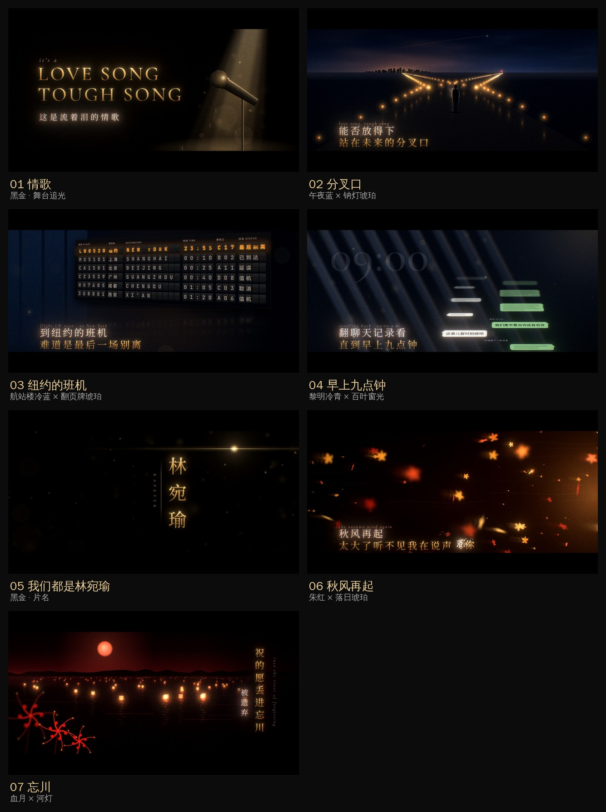

# Rapeter《林宛瑜》MV · 前 1:32

横屏 1920×1080，24fps，2.39:1 电影黑边。当前处于**风格帧阶段**：7 张关键画面已经出来了，方向确认后再按音乐节拍做完整动态。



## 歌曲结构（音频分析结果）

| 时间 | 段落 | 听感 |
|---|---|---|
| 0:00–0:23 | 副歌前半（It's a love song … 诉诸神明） | 乐器很少，没有鼓 |
| 0:24 | 鼓进来 | 约 81 BPM，一小节约 3 秒 |
| 0:24–0:46 | 副歌后半（love song tough song … 祈祷着等待答案） | 鼓点稳定 |
| 0:46–1:32 | 主歌（你说过这可能是你能想到的最好的结局 … 我知道你是诺诺不是上杉绘梨衣） | 能量最高，词最密 |

## 风格帧

每个歌词段落都有自己的颜色，但排版、黑边、胶片质感是同一套，所以整支片子是统一的。

| # | 画面 | 对应歌词 | 配色 |
|---|---|---|---|
| 01 | 空舞台、一束追光、一支话筒，光里有金粉和落下的水滴 | It's a love song, tough song / 这是流着泪的情歌 | 黑金 |
| 02 | 雨后的路在前面分成两条：左边通向城市的暖光，右边通向机场的蓝灯和红色信标；一个人站在分叉口，天上一架飞机正在离开 | 能否放得下 / 站在未来的分叉口 | 午夜蓝 × 钠灯琥珀 |
| 03 | 航站楼里的翻页航班牌，LW0520 飞往纽约，状态栏翻到「最后别离」 | 到纽约的班机 / 难道是最后一场别离 | 航站楼冷蓝 × 琥珀 |
| 04 | 百叶窗透进来的晨光；整段聊天记录斜着铺向黑暗，焦点落在「我们是不是也许还有也许」「这事儿暂时别提吧」 | 翻聊天记录看 / 直到早上九点钟 | 黎明冷青 × 薄荷绿 |
| 05 | 竖排片名，一道光横过黑场 | 但好像这个故事里面我们都是林宛瑜 | 黑金 |
| 06 | 落日逆光里的枫叶风暴；「爱你」两个字被风吹散成粉末 | 秋风再起 / 太大了听不见我在说声爱你 | 朱红 × 落日琥珀 |
| 07 | 忘川上漂远的河灯，血月，近处的彼岸花 | 祝的愿丢进忘川被遗弃 | 血月红 × 灯火金 |

各帧里 LW0520（林宛瑜 + 520）、「你撤回了一条消息」这类细节都是从歌词延伸出来的，可以改。

## 怎么做出来的

- **画面**：Remotion（Canvas + SVG + DOM 文字）渲染干净画面。路灯、河灯、粒子、透视都是程序生成，没有使用任何图片素材。
- **胶片感**：`scripts/post.py` 在线性光下做 bloom、halation（胶片的暖色光晕）、色差、分段调色、暗角、颗粒，最后加 2.39:1 黑边。
- **字体**：思源宋体、思源黑体、Cormorant Garamond、JetBrains Mono，都是 SIL OFL 开源字体，可商用。

## 渲染

```bash
npm install
pip install opencv-python-headless numpy
scripts/frames.sh                 # 渲染全部风格帧到 style-frames/
scripts/frames.sh fork lethe      # 只渲染其中几张
npm run studio                    # 在浏览器里逐帧预览
```

没装 Chrome 的机器，Remotion 会自动下载；也可以用 `REMOTION_BROWSER_EXECUTABLE` 指定一个本地的 Chrome Headless Shell。
